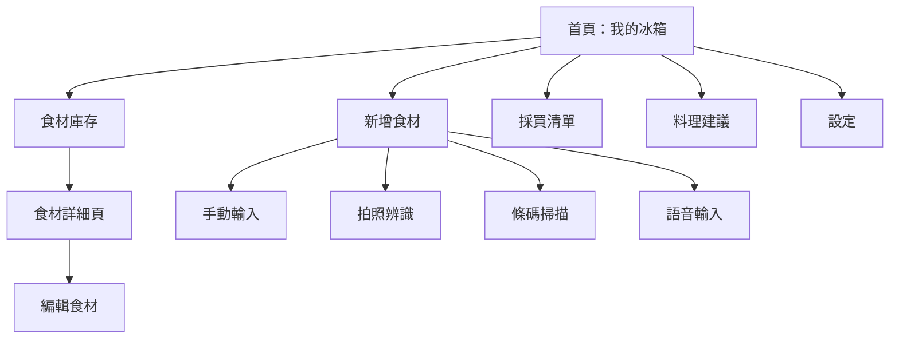
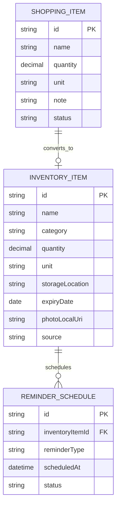
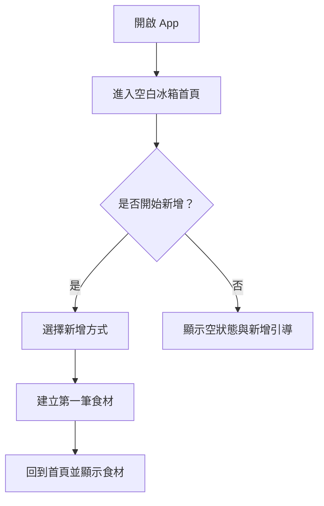
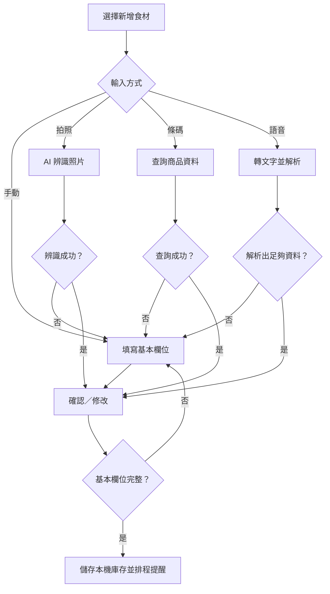
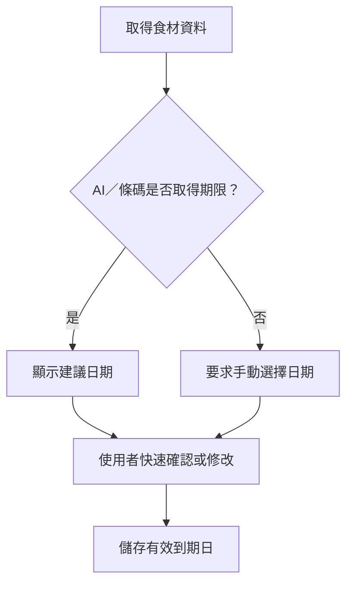
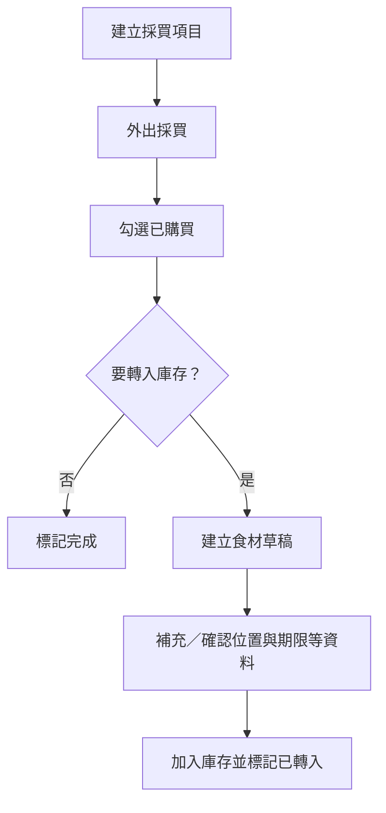
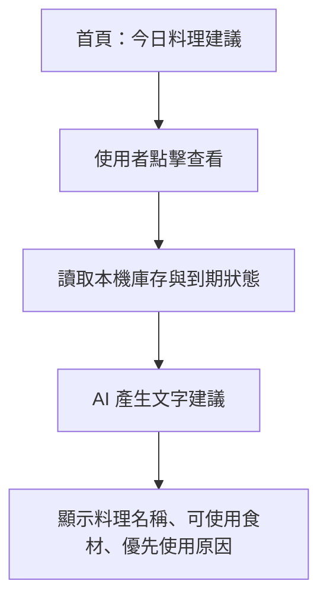

# 食材管理 App V1.0 產品規格文件

> 文件狀態：已確認規格  
> 版本：V1.0  
> 建立日期：2026-08-01  
> 產品名稱為暫定名稱。

---

## 目錄

1. [文件資訊](#1-文件資訊)
2. [產品概述](#2-產品概述)
3. [使用者與使用情境](#3-使用者與使用情境)
4. [範圍、優先級與不包含項目](#4-範圍優先級與不包含項目)
5. [資訊架構與導覽](#5-資訊架構與導覽)
6. [資料模型](#6-資料模型)
7. [功能規格](#7-功能規格)
8. [完整使用流程](#8-完整使用流程)
9. [UI 規格](#9-ui-規格)
10. [AI 與外部資料功能](#10-ai-與外部資料功能)
11. [提醒系統](#11-提醒系統)
12. [非功能需求](#12-非功能需求)
13. [驗收標準](#13-驗收標準)
14. [未來路線圖](#14-未來路線圖)
15. [附錄](#15-附錄)

---

## 1. 文件資訊

### 1.1 修訂紀錄

| 版本 | 日期 | 狀態 | 說明 |
|---|---|---|---|
| V1.0 | 2026-08-01 | Finalized PRD | 整合已確認的產品、流程、UI 與驗收需求。 |

### 1.2 決策解讀原則

本文件以對話中的**最後確認決策**為準。早期曾討論的「家庭管理擴充欄位」會保留為未來可選欄位；V1.0 的建立與驗收只要求基本欄位。食材照片則為拍照流程產生的本機附件，並非每筆手動新增都必填。

---

## 2. 產品概述

### 2.1 產品定位

「食材管理 App」是一個以家庭情境為核心、由單一管理者操作的本機手機 App。它協助使用者快速建立冰箱庫存、掌握保存期限、收到到期通知，並以 AI 協助新增食材及提供簡短料理方向，降低食材浪費。

### 2.2 產品目標

- 讓使用者快速知道家中有哪些食材、存放在哪裡。
- 降低新增食材的輸入負擔。
- 在食材到期前主動提醒。
- 讓採買項目能順暢地轉為庫存資料。
- 優先利用即將到期食材，提供簡易料理名稱建議。

### 2.3 核心原則

| 原則 | 說明 |
|---|---|
| 簡單 | V1.0 聚焦庫存、期限與採買，不發展為完整食譜或分析工具。 |
| 快速 | 首頁直接呈現到期食材、料理建議與冰箱分區。 |
| 低輸入負擔 | 優先支援拍照、條碼、語音等輔助輸入；失敗時回到可靠的手動輸入。 |
| 人工可控 | AI 只提出建議，寫入庫存前必須由使用者確認。 |
| 隱私優先 | 庫存、清單與照片保存於裝置本機；不需要帳號、同步或備份。 |

### 2.4 成功指標（產品驗證用）

- 使用者可在一次開啟 App 的流程中完成食材新增。
- 即將到期與當天到期食材可在首頁和通知中被辨識。
- 採買完成後可轉成待確認的庫存草稿。
- AI 或外部資料不可用時，核心手動庫存管理仍可完成。

---

## 3. 使用者與使用情境

### 3.1 主要使用者

**家庭食材管理者**：負責採買、整理冰箱或料理規劃的家庭成員。V1.0 採單一裝置、單一管理者模式；產品內容以家庭冰箱情境設計，但不支援多人共享。

### 3.2 主要情境

| 情境 | 使用者目標 | 預期行為 |
|---|---|---|
| 採買回家 | 快速記錄新食材 | 拍照、掃條碼、語音或手動新增後確認入庫。 |
| 料理前 | 找出可優先使用的食材 | 打開首頁，查看即將到期與料理建議。 |
| 外出購物 | 不漏買需要的項目 | 查看、編輯並勾選採買清單。 |
| 食材用完或變少 | 維持庫存正確 | 從詳細頁手動調整數量。 |
| 收到通知 | 處理即將到期食材 | 點進 App 查看對應食材與保存資訊。 |

---

## 4. 範圍、優先級與不包含項目

### 4.1 功能優先級

| 優先級 | 功能 | V1.0 說明 |
|---|---|---|
| Must | 冰箱首頁、庫存 CRUD、分類、搜尋 | 核心離線可用能力。 |
| Must | 手動新增、數量修改、到期狀態 | 所有其他輸入方式的可靠備援。 |
| Must | 到期前 3 天與到期當天的本機通知 | 通知權限允許時啟用。 |
| Must | 基本採買清單與確認後轉庫存 | 避免採買清單與庫存脫節。 |
| Should | 拍照 AI 輔助、條碼商品查詢、語音自然語言解析 | 需使用者確認，服務失敗時轉手動輸入。 |
| Should | AI 文字料理建議 | 根據現有庫存及即將到期食材提供名稱與所用食材。 |
| Could | 自訂食材類型、提醒開關與資料清除 | 置於設定頁，依開發排程實作。 |

### 4.2 V1.0 不包含（Out of Scope）

- 帳號、登入、雲端同步、家庭多人共用與權限。
- 使用者主動備份、匯出或匯入資料。
- 自動扣減庫存、食譜連動扣庫存與消耗預測。
- 完整食譜、烹調步驟、影片、計時器、營養與過敏原分析。
- 消耗趨勢、浪費分析、價格統計或儀表板統計。
- AI 自動寫入庫存；所有輸入方式都須在寫入前確認。
- 條碼找不到商品時的自建商品資料庫；改用手動建立。

---

## 5. 資訊架構與導覽

### 5.1 主要頁面

| 頁面 | 目的 | 主要操作 |
|---|---|---|
| 首頁（冰箱） | 一眼掌握需處理食材與存放分區 | 查看到期食材、料理建議、分區、快速新增。 |
| 食材庫存 | 查看、搜尋與管理全部庫存 | 搜尋、依位置/類型瀏覽、查看詳情、編輯、刪除。 |
| 新增食材 | 統一入口 | 手動、拍照、條碼、語音。 |
| 採買清單 | 管理待購買事項 | 新增、勾選、產生轉庫存草稿。 |
| 設定 | 管理基本偏好與資料 | 提醒、分類、清除資料、App 資訊。 |



### 5.2 分類架構

採用「**存放位置 + 食材類型**」雙層分類。存放位置為首頁與瀏覽的第一層；類型用於食材描述、篩選與 AI 建議。

| 存放位置 | 預設食材類型範例 |
|---|---|
| 冷藏 | 蔬菜、水果、乳製品、蛋類、飲料等。 |
| 冷凍 | 肉類、海鮮、冷凍食品等。 |
| 常溫 | 主食、調味料、罐頭／乾貨等。 |

預設食材類型至少包含：肉類、蔬菜、水果、乳製品、蛋類、海鮮、冷凍食品、主食、調味料、罐頭／乾貨。設定頁可管理類型名稱與自訂類型。

---

## 6. 資料模型

### 6.1 食材（InventoryItem）

| 欄位 | 型別／格式 | 必填 | 說明 |
|---|---|:---:|---|
| `id` | UUID／本機唯一值 | 是 | 系統識別碼。 |
| `name` | 文字 | 是 | 食材或商品名稱。 |
| `category` | 文字／分類 ID | 是 | 食材類型，如肉類、乳製品。 |
| `quantity` | 正數 | 是 | 目前剩餘數量。 |
| `unit` | 文字／單位 ID | 是 | 如包、盒、瓶、顆、把、公斤。 |
| `storageLocation` | enum | 是 | `冷藏`、`冷凍`、`常溫`。 |
| `expiryDate` | 日期 | 是 | 到期日；AI 未取得時由使用者輸入。 |
| `photoLocalUri` | 本機路徑 | 否 | 拍照新增時保留的本機原始照片。 |
| `source` | enum | 是 | `manual`、`photo_ai`、`barcode`、`voice`、`shopping_draft`。 |
| `createdAt` / `updatedAt` | 日期時間 | 是 | 建立與最後修改時間。 |

以下欄位不屬於 V1.0 必填資料，但資料模型可預留作日後擴充：購買日期、購買來源、價格、品牌、開封狀態、AI 信心度與辨識原始結果。

### 6.2 採買項目（ShoppingItem）

| 欄位 | 必填 | 說明 |
|---|:---:|---|
| `id` | 是 | 本機唯一識別碼。 |
| `name` | 是 | 欲購買食材名稱。 |
| `quantity` | 是 | 預計購買數量。 |
| `unit` | 是 | 預計購買單位。 |
| `note` | 否 | 例如「買大盒」。 |
| `status` | 是 | `pending`、`purchased`、`converted`。 |
| `inventoryDraftId` | 否 | 勾選購買後建立草稿時的對應值。 |

### 6.3 通知排程（ReminderSchedule）

| 欄位 | 說明 |
|---|---|
| `inventoryItemId` | 對應的食材。 |
| `reminderType` | `three_days_before` 或 `expiry_day`。 |
| `scheduledAt` | 預計通知時間。 |
| `status` | 已排程、已送出、取消。 |

### 6.4 關聯圖



---

## 7. 功能規格

### 7.1 首頁：冰箱儀表板

首頁資訊由上而下排列：

1. 即將到期／已到期食材。
2. 今日料理建議入口與摘要。
3. 冷藏、冷凍、常溫三個存放位置入口。
4. 快速操作：手動新增、拍照新增、掃描條碼、語音新增、採買清單。

首頁不顯示食材總數、分類比例、消耗趨勢或其他統計圖表。點擊存放位置後進入該分區的食材清單。

### 7.2 食材庫存與搜尋

- 以文字清單呈現，至少顯示名稱、數量＋單位、存放位置與到期日期／狀態。
- 預設排序：已過期 → 即將到期 → 一般食材；相同狀態優先最近新增。
- 搜尋欄支援食材名稱，並可一併比對品牌、備註等未來可選欄位（若有資料）。
- 點擊單筆食材進入詳細頁，可修改所有基本欄位或刪除。
- 數量更新採手動編輯，沒有自動扣減機制。

### 7.3 新增食材：共同規則

- 所有新增方式的結果都會進入「確認／修改」畫面。
- 使用者可直接按「加入庫存」快速確認，也可改為手動修改欄位。
- 寫入時必須具備 6 個基本欄位；缺少保存期限時要求補輸入。
- 任一 AI 或商品查詢失敗時，導向手動輸入流程，避免造成工作中斷。

### 7.4 手動輸入

使用者輸入或選擇：食材名稱、分類、數量、單位、存放位置、保存期限；完成後儲存至本機庫存。

### 7.5 拍照新增

- 使用者拍攝食材或包裝照片。
- AI 嘗試提出名稱、分類、數量／單位（若可判斷）、建議存放位置與保存期限。
- 保存期限優先取自包裝上的有效期限、製造日期＋保存天數或可取得的商品資訊；若無法可靠取得，要求手動輸入到期日。
- 使用者採快速確認或修改後加入庫存。
- 若 AI 無法辨識，直接開啟手動輸入頁；已拍照片可依實作決定保留為本機附件。

### 7.6 條碼掃描

- 掃描包裝食品條碼並查詢商品資料來源。
- 查詢成功時，預填商品名稱、品牌（若有）、商品類型、規格、包裝資訊與商品圖（若有）。
- 使用者仍須確認並補足數量、單位、存放位置與保存期限後入庫。
- 查無商品時，顯示原因並轉往手動新增。

### 7.7 語音新增

- 使用者以自然語句描述，例如：「昨天買了兩盒雞蛋，放冷藏，十天後到期。」
- 系統先將語音轉文字，再由 AI 解析食材名稱、數量、單位、存放位置、購買日期與保存期限等可辨識資訊。
- 顯示可編輯確認畫面；缺少必填資料時要求補齊。
- 解析失敗時提供手動輸入。

### 7.8 採買清單

- 可新增名稱、數量、單位與備註的採買項目。
- 可勾選已購買項目。
- 勾選後建立待確認的庫存草稿，而不是直接寫入庫存。
- 使用者在草稿中確認或補充分類、數量、單位、位置與保存期限後，才加入庫存。
- 使用者也可只把項目標記為完成而不轉入庫存。

### 7.9 設定

- 到期提醒開關與系統通知權限狀態。
- 食材類型管理（查看、改名與新增自訂類型）。
- 清除所有食材資料與清除本機照片資料；每一項均須二次確認。
- App 版本、使用說明與隱私說明。

---

## 8. 完整使用流程

### 8.1 首次使用



### 8.2 新增食材總流程



### 8.3 保存期限處理



### 8.4 採買轉庫存



### 8.5 料理建議



---

## 9. UI 規格

### 9.1 共通介面原則

- 手機優先，單手可操作。
- 優先以清楚文字、狀態色與圖示表達；紅色為已過期、橘色為即將到期、一般狀態採中性顏色。
- 所有破壞性操作（刪除、清除資料）須有明確警示與二次確認。
- AI 結果需標示為「建議」，不能呈現為不可更改的事實。

### 9.2 首頁線框稿

```text
┌────────────────────────────────┐
│ 🧊 我的冰箱                     │
├────────────────────────────────┤
│ ⚠️ 即將到期                     │
│  青菜｜明天到期                 │
│  牛奶｜3 天後到期               │
│  [查看全部]                     │
├────────────────────────────────┤
│ 🍳 今日料理建議                 │
│  看看現有食材可以做什麼 ＞      │
├────────────────────────────────┤
│ 🧊 冷藏 ＞   ❄️ 冷凍 ＞         │
│ 🏠 常溫 ＞                      │
├────────────────────────────────┤
│ ➕ 新增  📷 拍照  🏷 掃碼       │
│ 🎤 語音  🛒 採買                │
└────────────────────────────────┘
```

### 9.3 食材清單與詳細頁

```text
冷藏 ＞ 蔬菜
┌──────────────────────────────┐
│ 青江菜                         │
│ 數量：2 把   到期：明天 ⚠️      │
└──────────────────────────────┘
┌──────────────────────────────┐
│ 番茄                           │
│ 數量：6 顆   到期：2026/08/08  │
└──────────────────────────────┘
```

詳細頁至少顯示食材照片（若有）、名稱、分類、數量、單位、位置、保存期限、建立來源，以及「編輯」「刪除」動作。

### 9.4 新增與 AI 確認畫面

```text
AI 辨識結果

名稱：雞胸肉
分類：肉類
數量：1 包
位置：冷凍
保存期限：2026/08/30

[✅ 加入庫存]   [✏️ 修改資料]
```

快速確認模式的重點是允許直接加入，但任一欄位都必須可修改。缺少必填欄位時，「加入庫存」改為提示補齊資料。

---

## 10. AI 與外部資料功能

### 10.1 AI 功能邊界

| 功能 | 輸入 | 預期輸出 | 使用者控制 |
|---|---|---|---|
| 食材照片辨識 | 食材／商品照片 | 名稱、分類、數量／單位（可得時）、位置建議 | 確認或修改後才寫入。 |
| 保存期限判斷 | 包裝文字、日期、商品資訊、食材類型 | 到期日或保存期限建議 | 無可靠結果即手動輸入。 |
| 語音自然語言解析 | 使用者語音／轉寫文字 | 名稱、數量、單位、位置、日期等欄位 | 顯示可編輯草稿。 |
| 料理建議 | 本機庫存、到期狀態 | 料理名稱、可使用食材、優先使用理由 | 僅供建議，不修改庫存。 |

### 10.2 AI 料理建議輸出規格

每則建議應包含：

- 料理名稱。
- 本次可使用的庫存食材。
- 若涉及即將到期食材，說明優先使用原因。

不提供詳細步驟、調味比例、營養資訊、影片或自動扣庫存。

### 10.3 網路與隱私說明

本機資料與照片的**保存位置**在裝置本機。拍照辨識、語音解析、商品條碼查詢與料理建議若採雲端服務，為取得結果可能需在使用者操作當下傳送必要的照片、文字或條碼資料至所選服務；實作時必須在隱私說明中明確揭露服務、用途與資料範圍。當網路或服務不可用時，手動新增、瀏覽、編輯、搜尋、採買清單與已排定提醒須仍可使用。

---

## 11. 提醒系統

### 11.1 規則

| 條件 | 狀態 | 行為 |
|---|---|---|
| 到期日前 3 天 | 即將到期 | 排定並送出本機系統通知。 |
| 到期當天 | 到期 | 排定並送出本機系統通知。 |
| 已超過到期日 | 已過期 | 在首頁與清單中優先顯示；V1.0 不額外定義每日重複通知。 |

新增、修改或刪除食材時，系統必須同步建立、更新或取消該食材相關的本機通知排程。通知權限關閉時，首頁與清單的到期狀態仍須正常顯示。

### 11.2 通知內容範例

- 到期前 3 天：`食材提醒：牛奶將於 3 天後到期，建議優先使用。`
- 到期當天：`食材提醒：青菜今天到期，請確認是否需要使用。`

---

## 12. 非功能需求

| 類別 | 需求 |
|---|---|
| 平台 | 以手機 App 為目標；實際支援平台與技術框架留待技術規格決定。 |
| 本機優先 | 庫存、清單、設定與照片路徑保存在裝置本機。 |
| 離線能力 | 核心瀏覽、新增（手動）、修改、刪除、搜尋、採買與到期狀態可離線使用。 |
| 網路依賴 | AI、語音、條碼商品查詢與料理建議可依服務需求使用網路，失敗時需有明確回退。 |
| 隱私 | 不要求帳號；不提供雲端同步與產品內備份。外部 AI 資料傳送需明確告知。 |
| 效能 | 一般庫存清單、搜尋及詳情開啟應有即時感；不得因 AI 服務延遲阻塞手動流程。 |
| 可用性 | 必填欄位、錯誤原因與回退操作須清楚可理解；不得只以顏色傳達狀態。 |
| 資料安全 | 刪除／清除動作需二次確認；使用者需在設定頁看到「無備份，裝置遺失可能造成資料遺失」的提示。 |

---

## 13. 驗收標準

| 模組 | 驗收條件 |
|---|---|
| 首頁 | 能顯示即將到期區、料理建議入口、冷藏／冷凍／常溫入口及快速操作；不顯示統計儀表板。 |
| 手動新增 | 填妥 6 個基本欄位後能新增並立即在對應分區清單看到食材。 |
| 欄位驗證 | 缺少名稱、分類、數量、單位、位置或保存期限時，系統不允許寫入並指出需補欄位。 |
| 食材清單 | 預設以已過期、即將到期、一般食材的順序顯示；每筆可看到名稱、數量與到期資訊。 |
| 搜尋 | 輸入名稱關鍵字可找出相符食材；無結果時呈現空狀態。 |
| 編輯／刪除 | 可修改 6 個基本欄位；刪除後食材與其提醒排程一併移除，刪除前須確認。 |
| 拍照 AI | AI 成功時產生可編輯結果並可快速確認；失敗時可直接轉手動輸入。 |
| 保存期限 | 可採用 AI 建議或手動改期；AI 未取得期限時必須要求輸入日期。 |
| 條碼 | 查到商品時預填商品資訊並要求使用者確認必填欄位；查不到時可轉手動輸入。 |
| 語音 | 可把可辨識的自然語句轉為可編輯草稿；解析不完整時可補填，失敗時可手動輸入。 |
| 提醒 | 對有有效保存期限的食材，能在到期前 3 天與到期日建立通知；關閉權限不影響 App 內狀態。 |
| 採買清單 | 可新增、編輯、勾選項目；勾選後可建立草稿，補足欄位後加入庫存，也可只完成不入庫。 |
| 料理建議 | 可依現有庫存產生文字建議，顯示料理名稱與可使用食材；不得更動庫存或輸出完整食譜。 |
| 本機保存 | 結束並重新開啟 App 後，本機庫存與採買資料仍可讀取；無網路時手動核心流程仍可使用。 |
| 設定 | 可調整提醒開關、查看／管理分類、清除資料與照片（各自二次確認）、查看版本與隱私說明。 |

---

## 14. 未來路線圖

### V1.1：便利性與資料韌性

- 手動匯出／匯入資料與照片。
- 更完整的自訂分類與單位管理。
- 改善拍照失敗時的重新拍攝指引。
- 保存照片縮圖或容量管理策略。

### V2.0：家庭協作與智慧管理

- 帳號、雲端同步、資料備份與多裝置使用。
- 家庭共享冰箱、成員權限與共用提醒。
- 智慧到期提醒、消耗速度與食材不足推估。
- 料理步驟、缺料提示及料理後庫存扣減。
- 使用與浪費統計、價格／採買分析。

### 後續探索項目

- 多冰箱或多儲物區管理。
- 完整商品資料來源策略與台灣在地商品覆蓋率。
- 條碼與包裝文字辨識的可靠性評估。
- AI 處理成本、隱私告知與離線模型可行性。

---

## 15. 附錄

### 附錄 A：名詞表

| 名詞 | 定義 |
|---|---|
| 庫存 | 已加入 App、目前由使用者持有的食材記錄。 |
| 食材草稿 | 尚未正式寫入庫存、等待補充或確認必填欄位的資料。 |
| 存放位置 | 冷藏、冷凍、常溫等保存區域。 |
| 食材類型 | 如肉類、蔬菜、乳製品等用於描述食材的分類。 |
| 即將到期 | 到期日前 3 天內的食材。 |
| 快速確認 | 使用者可直接採用 AI 預填結果加入庫存，但仍可修改的確認方式。 |
| 本機保存 | 資料與照片儲存在使用者裝置，不提供 App 內雲端同步。 |

### 附錄 B：狀態與錯誤處理矩陣

| 情境 | 使用者看到的結果 | 必要回退 |
|---|---|---|
| 空冰箱 | 空狀態與新增引導 | 可直接選擇新增方式。 |
| AI 無法辨識照片 | 清楚提示辨識失敗 | 導向手動輸入。 |
| 條碼查無資料 | 清楚提示無商品資料 | 導向手動輸入。 |
| 語音解析不完整 | 顯示已解析內容與缺少欄位 | 可補填或改手動輸入。 |
| 沒有網路 | 告知 AI／查詢不可用 | 核心本機操作及手動輸入持續可用。 |
| 通知權限關閉 | 設定頁顯示權限狀態 | 首頁／清單仍顯示到期狀態。 |
| 到期日未知 | 不允許作為完成庫存記錄 | 使用者必須手動選擇日期。 |

### 附錄 C：開發交接待決事項

以下事項不改變本 PRD，需在技術設計階段決定：

1. 目標平台（iOS、Android 或跨平台）與 App 框架。
2. 本機資料庫、照片儲存路徑與資料清除實作方式。
3. AI 供應商、模型、影像／語音傳送條件、成本與隱私告知文案。
4. 條碼掃描套件與可使用的商品資料來源、授權與查詢限制。
5. 本機通知排程在各平台的行為與時區處理。
6. 食材類型與單位的預設清單、是否支援小數數量。

---

**文件結束。**
